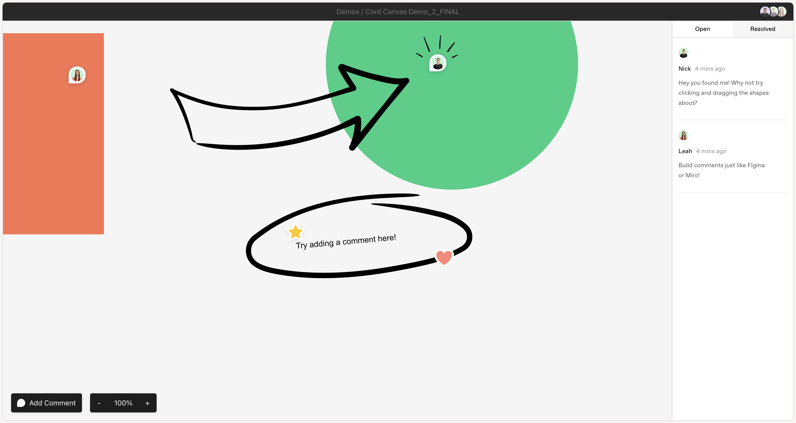

</img>

# [cord-sdk](https://docs.cord.com/) &middot; Canvas

Want to play with a live version? Head to our [Docs live demos](https://docs.cord.com/get-started/demo-apps/canvas-new)!

</img>

## 🏃 How to Run

1. Clone the [demo-apps](https://github.com/getcord/demo-apps) repository.

2. Navigate to the canvas directory:

```bash
cd demo-apps/canvas-new
```

3. Install the dependencies:

```bash
npm i
```

4. Run the app:

```bash
npm run dev
```

5. Get developing! You're now running a [ViteJS](https://vitejs.dev/guide/) project, so changes will be instantly reflected in the browser, and much more ✨
